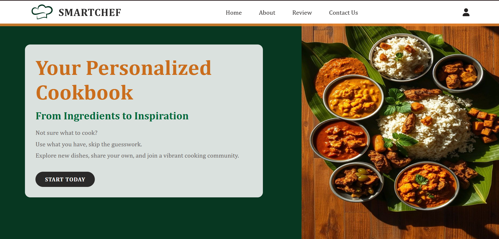
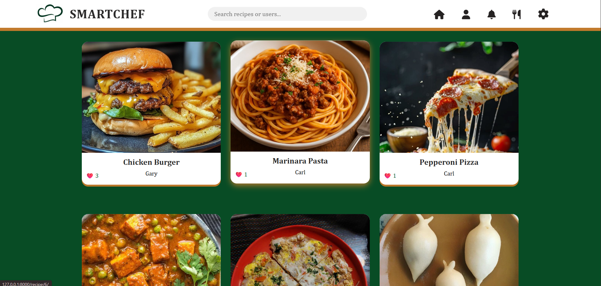
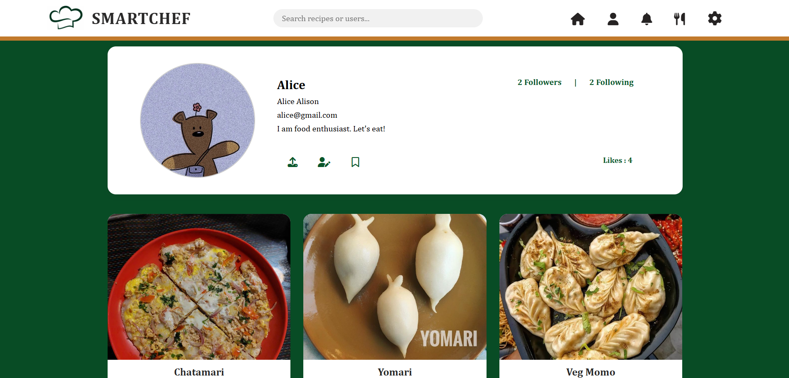
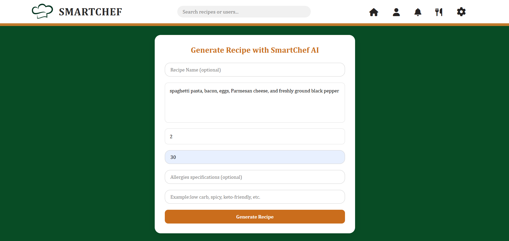
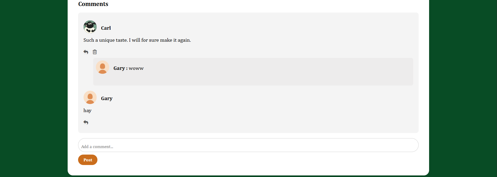

#  SmartChef — AI Powered Social Cooking Platform

SmartChef is a social cooking platform that combines recipe sharing with AI-powered recipe generation. Users can create, browse, and share recipes, and also generate new recipes using AI based on ingredients and preferences.

---

#  Project Background

This project was originally developed as part of an **academic group project**.

Original Organization :
https://github.com/minorproject777

There were multiple development iterations during the development phase, the project was split across different repositories.

This repository contains the **final cleaned and consolidated version** of the SmartChef project, optimized for demonstration purposes.

---

#  Features

- User authentication system (Django backend)
- Create, edit, and share recipes
- Browse community recipes (social platform)
- AI-powered recipe generation
- Responsive frontend using HTML, CSS, JavaScript

---

#  AI Integration

SmartChef includes an AI recipe generator powered by:

- **LLaMA 3.3 70B Versatile Model (via API)**
- **Groq API integration**
- **ChromaDB vector database**
- Retrieval-Augmented Generation (RAG approach)
  

---

#  Tech Stack

## Frontend:
- HTML
- CSS
- JavaScript

## Backend:
- Python
- Django
- SQL Database

## AI / ML:
- LLaMA 3.3 70B (via API)
- Groq API
- ChromaDB

---

# Project Structure
smartchef_final/
│
├── accounts/ # Django backend
    ├──templates/ #(HTML)
├── assistant/ # AI + ChromaDB integration
├── static/ # Assets (JS/CSS/images)
├── smartchef
└── README.md

---

#  Setup Instructions

## 1. Clone repository
git clone https://github.com/mudhitaa/smartchef.git
cd smartchef

## 2. Create virtual environment
python -m venv venv
venv\Scripts\activate   # Windows

## 3. Install dependencies
pip install -r requirements.txt

## 4. run server
python manage.py runserver

# Project Purpose
SmartChef was built as an academic full-stack project to explore:
    Social platforms, 
    Full-stack web development, 
    AI integration using LLMs, 
    Retrieval-Augmented Generation (RAG)

#  My Role

This was a team-based academic project. My primary responsibility was full-stack development of the SmartChef platform.

### My contributions:

- Designed and developed the frontend using HTML, CSS, and JavaScript
- Built backend architecture using Python Django
- Developed REST APIs for recipe management and user interactions
- Designed and implemented SQL database structure
- Integrated frontend and backend systems for end-to-end functionality
- Managed overall project structure and coordination within the application layer

### AI Integration:
The AI-powered recipe generation module was developed and implemented by another team member and integrated into the platform as an external system component.

# Future Improvements
- Migration of frontend to React (MERN stack transition)
- Improved recommendation system for personalized recipes
- Real-time chat feature between users
- Mobile application version
- Cloud deployment with CI/CD pipeline
- Enhanced AI response tuning for better recipe accuracy

# Developer Note 
This is my first full-stack project, developed using Python/Django stack.

#  Screenshots

## Landing Page

## Home Page

## Profile Page

## AI Recipe Generator

## Comments Section

